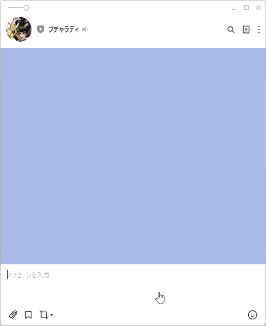
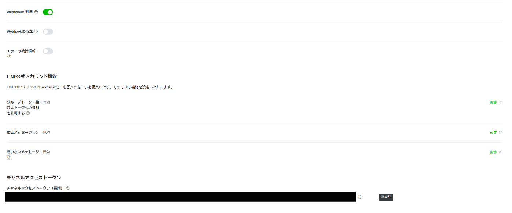
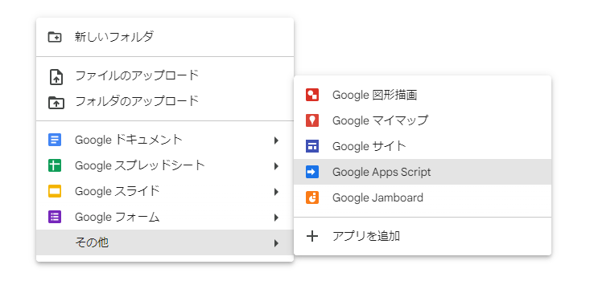
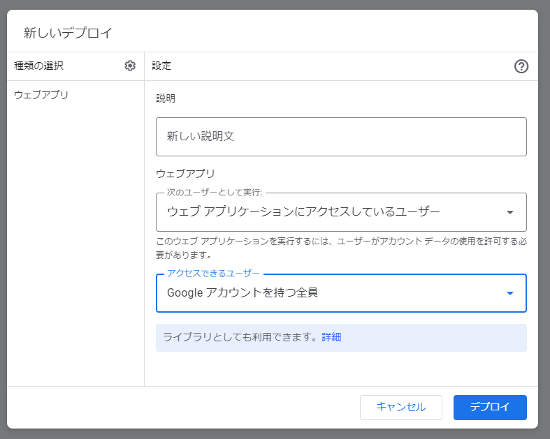
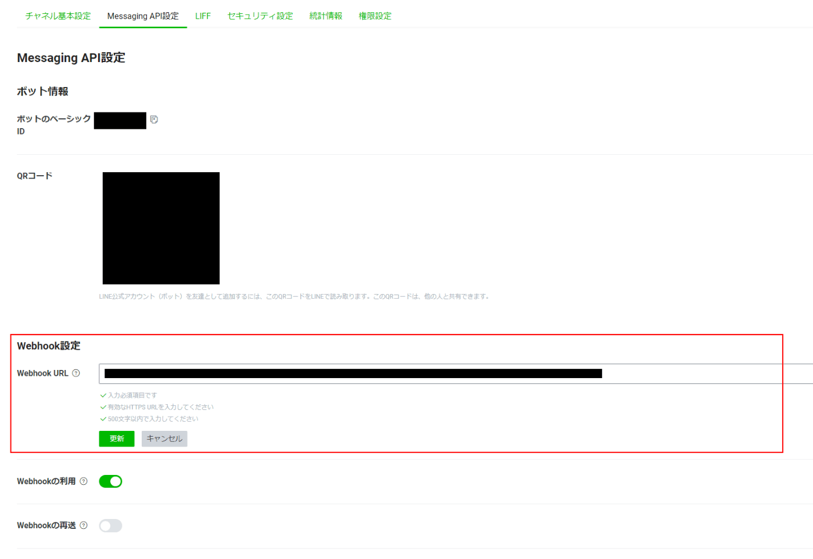

最近、GAS（GoogleAppsScript）に興味を持ったので、これなら気軽に始められそうと感じ、「翻訳LINEボット」を作ってみた話を紹介しようと思います。

ちなみに全部韓国語に翻訳してくれるようになってます。



難易度としては、JavaScriptが理解できれば容易に理解できるレベル感だと感じました！

想像以上に簡単に作成できました！

## 大まかにやったこと

1. LINEアカウントの作成
2. 翻訳APIの作成（GAS）
3. LINEボット用のスクリプト作成（GAS）
4. LINEアカウントでスクリプトを実行するように設定

## LINE アカウントの作成

まずは以下から、LINE公式アカウント作成しました。

https://manager.line.biz/

アカウント作成後はLINEDevelopersへ移動。

https://developers.line.biz/console/

チャネルアクセストークン（長期）の取得と、「Webhookの利用」をオンに変更しました。



これで大体、LINE側で設定はほぼほぼ完了です。

## 翻訳APIの作成

初めてGASを使用したのですが、思ったより簡単にできました！

ファイルの作成方法は、GoogleDriveの右クリックでGoogleAppsScriptを選択するだけでした。

使用感は、JavaScriptと大差なかった印象です！



ここから、ソースを書いていく工程ですが、まずは翻訳APIの作成から始めました。

```js
function doGet(translateText) {
  var textParameter = translateText.parameter;
  var translatedText = LanguageApp.translate(
    // text：Hello
    // sourceLanguage：en（※空文字なら自動判別）
    // targetLanguage：ja
    // 【言語サポート 文字コード】
    // https://cloud.google.com/translate/docs/languages?hl=ja
    textParameter.text,
    textParameter.sourceLanguage,
    textParameter.targetLanguage,
  );
  var body;

  if (translatedText) {
    body = {
      code: 200,
      text: translatedText,
    };
  } else {
    body = {
      code: 400,
      text: "Bad Request",
    };
  }

  var response = ContentService.createTextOutput();
  response.setMimeType(ContentService.MimeType.JSON);
  response.setContent(JSON.stringify(body));

  return response;
}
```

やってることはシンプルで、APIのリクエストとして「翻訳したいテキスト」「翻訳したいテキストの言語」「翻訳したい言語」を受け取りそれらを基に`LanguageApp.translate()`の関数を使用して翻訳を行う。

そして、成功したら200番、失敗したら400番を返す仕組みです。

レスポンスもJson形式で返すようになっています！

スクリプトが完成したら、「ウェブアプリ」としてデプロイして、下記のようなURLでアクセスしたら翻訳APIの完成です！

### URL

`https://${デプロイしたURL} + "?text=" + ${ text } + "&sourceLanguage=" + ${ sourceLanguage } + "&targetLanguage=" + ${ targetLanguage }`

### Sample URL

`https://○○?text=Hello&sourceLanguage=en&targetLanguage=ja`

## LINEボット用のスクリプト作成

翻訳APIの作成方法と同じ要領で、こちらもコードを記述します。

```js
// LINEMessageAPIアクセストークン
const ACCESS_TOKEN = ${ ACCESS_TOKEN };
// 翻訳APIのURL
const TRANSLATE_API_URL =
  "${ deploy URL }?text=";
// 文字コード（https://cloud.google.com/translate/docs/languages?hl=ja）
const sourceLanguage = ""; // 空文字で言語を自動判別
const targetLanguage = "ko"; // 翻訳したい文字コード

function doPost(e) {
  const events = JSON.parse(e.postData.contents).events[0];
  const replyToken = events.replyToken;
  const userMessage = events.message.text;

  // 翻訳APIを使用
  var response = UrlFetchApp.fetch(
    TRANSLATE_API_URL +
      userMessage +
      "&sourceLanguage=" +
      sourceLanguage +
      "&targetLanguage=" +
      targetLanguage
  ).getContentText();
  var translatedText = JSON.parse(response).text;

  // 返信処理
  UrlFetchApp.fetch("https://api.line.me/v2/ボット/message/reply", {
    headers: {
      "Content-Type": "application/json",
      Authorization: "Bearer " + ACCESS_TOKEN,
    },
    method: "post",
    payload: JSON.stringify({
      replyToken: replyToken,
      messages: [
        {
          type: "text",
          text: translatedText,
        },
      ],
    }),
  });
}
```

`${ ACCESS_TOKEN }`の箇所に取得したアクセストークンを設定します。

処理の概要としては、送信されてきてテキストを作成した「翻訳API」を使用して翻訳し、その後、LINEDevelopersで用意されている返信用のAPIを使用して、LINE上でリプライを送るといった流れです。

このスクリプトも完成したら、「ウェブアプリ」としてデプロイします。



## LINEアカウントでスクリプトを実行するように設定

最後はLINEDevelopersにログインし、対象のアカウントを選択、そして「MessagingAPI設定」を開きます。

そこで「Webhook設定」を編集し、リプライ用のスクリプトでデプロイしたURLをコピペします！



これで完成です！！
