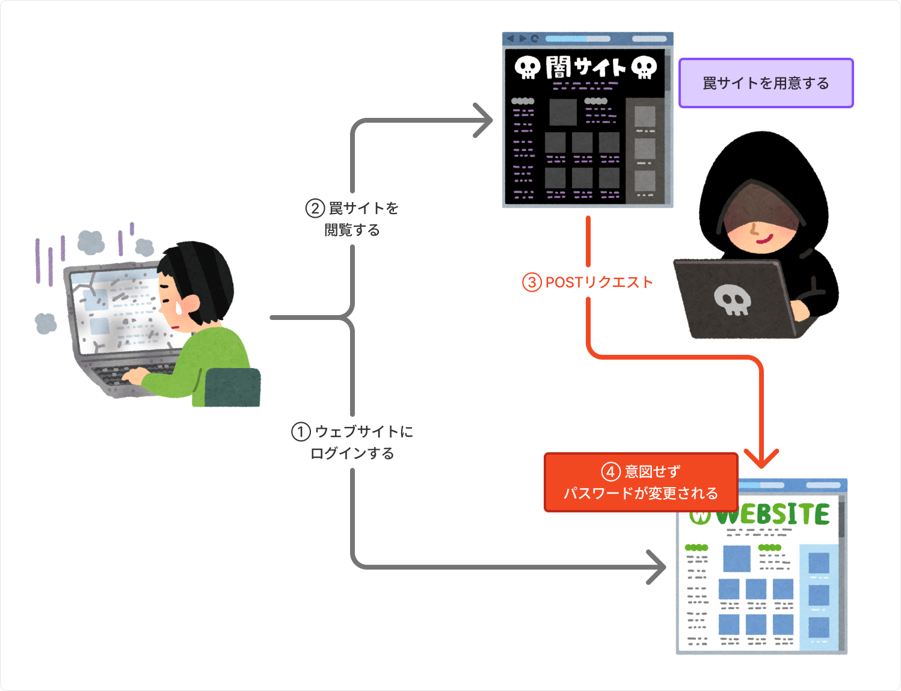

クロスサイト・リクエストフォージェリ（CSRF: Cross-Site Request Forgery）について勉強しました。

CSRFってよく聞くけど、「どんな攻撃だったっけ？」って思うことが多いので、基本的なところから対策までを整理します。

## CSRFとは？

> ログインしたユーザーからのリクエストについて、そのユーザーが意図したリクエストであるかどうかを識別する仕組みを持たないウェブサイトは、外部サイトを経由した悪意のあるリクエストを受け入れてしまう場合があります。<br/>
> このようなウェブサイトにログインしたユーザーは、悪意のある人が用意した罠により、ユーザーが予期しない処理を実行させられてしまう可能性があります。

つまり、信頼されたユーザーになりすまして、ウェブサイトに対して不正なコマンドを送信する攻撃手法のこと。

### CSRFによる影響

- ユーザーが意図していない物品の購入
- ユーザーが意図していない退会処理
- ユーザーアカウントによる、SNS や問い合わせへの書き込み
- ユーザーのパスワードやメールアドレスの変更

## CSRFの仕組み

例えば、以下のようなパスワード変更処理があるとします。

```php title="change_password.php"
<?php
function ex($s)
{
    echo htmlspecialchars($s, ENT_COMPAT, "UTF-8");
}
session_start();
$id = @$_SESSION["id"];
/* ログイン状態の確認... */
$pwd = filter_input(INPUT_POST, "pwd");
/* パスワードの変更処理... */
?>
```

パスワード変更に必要な条件は以下の通りです。

1. POSTメソッドで`change_password.php`にアクセスする
2. ログイン状態である
3. `pwd`パラメータに新しいパスワードを指定する

ユーザーがウェブサイトにログインしている状態で、以下のようなHTMLが仕込まれたウェブページを閲覧すると、ユーザーのパスワードが意図せず変更されてしまいます。

```html title="attack.html"
<body onload="document.form[0].submit()">
  <form action="http://xxx.com/change_password.php" method="POST">
    <input type="hidden" name="pwd" value="hacked_password" />
  </form>
</body>
```

流れとしては以下の図のようになります。

②の時点で、ログイン情報は自動的に罠サイトに送信されてしまうため、③のPOSTリクエストでパスワードが変更されてしまいます。



CSRF自体は、攻撃者が画面を参照できないため、情報を直接盗み出すことはできませんが、パスワード変更などの操作を行わせることで、不正ログインを可能にし、結果的に情報を盗み出すことが可能になります。

## 脆弱性のあるサイトの特徴

CSRF攻撃の対象となるサイトとして、以下のようなものがあります。

- Cookieを用いたセッション管理
- HTTP認証、TSLクライアント認証を用いたユーザーの識別

上記の特徴を持つサイトでは、リクエストに対してユーザーが意図したものであるかどうかを識別する仕組みがない場合、CSRF攻撃の対象となる可能性があり、該当するサイトを運営している場合は、CSRF対策を検討する必要があります。

## 脆弱性の原因

以下のWebの仕様が、CSRF脆弱性の原因となっています。

### 1. form要素のaction属性などに外部サイトのURLが指定できる

罠サイトなどの別サイトからでも、攻撃対象サイトのURLを指定してリクエストを送信できる。

### 2. Cookieに保管されたセッションIDは、対象サイトにアクセスする際に自動的に送信される

罠サイト経由で攻撃対象サイトにアクセスしても、Cookieに保管されたセッションIDが自動的に送信される。

つまり、攻撃対象となるサイトにログインしているユーザーが罠サイトを閲覧した場合、そのユーザーになりすましてリクエストを送信できてしまう。

例えばこんな感じで、異なるサイトからのリクエストでもRefererが異なるだけで、Cookieは自動的に送信されてしまいます...

#### ユーザーの意図したリクエスト

```txt frame="terminal" {2}
POST change_password.php HTTP/1.1
Referer: http://example.com/index.php
Content-Type: application/x-www-form-urlencoded
Content-Length: 19
Cookie: PHPSESSID=xxxxxxxxxxxxxx
Host: xxx.com

pwd=password
```

#### CSRF攻撃によるリクエスト

```txt frame="terminal" {2}
POST change_password.php HTTP/1.1
Referer: http://trap.com/index.php
Content-Type: application/x-www-form-urlencoded
Content-Length: 19
Cookie: PHPSESSID=xxxxxxxxxxxxxx
Host: xxx.com

pwd=password
```

CookieのSameSite属性を設定することで、CSRF攻撃を防止できる場合がありますが、全てのブラウザで対応しているわけではないなどの問題もあるため、他の対策も併用することが良い。

## 対策

対策としては、ユーザーの意図したリクエストを確認することが重要になります。

### 1. CSRF攻撃が可能なページにトークン情報を埋め込む

まず、ユーザーの入力内容を確認画面として出力する際、合わせてトークン情報を「hiddenパラメータ」に出力するようにします。

このトークン情報は第三者が知り得ない秘密情報である必要があるため、生成するトークン情報は**暗号論的擬似乱数生成器**を用います。

次に確認画面から登録処理のリクエストを受けた際は、リクエスト内容に含まれる「hiddenパラメータ」の値と、トークン情報とを比較し、一致しない場合は登録処理を行わないようにします。

> このリクエストは、POSTメソッドを使用します。
> GETメソッドで行った場合、Refererによりトークン情報が漏洩する可能性があるためです。

### 2. パスワードの再入力を求める

これはシンプルですが、ユーザーにパスワードの再入力を求めることで、CSRF攻撃を防止する方法です。

この実装を行う場合は、必ず最終確認画面でパスワードの再入力を求めるようにします。

> ユーザーの利便性が低下するとともに、画面設計の仕様変更にもなりかねないため、なりすましへの対策や確認を強く求める場面で適用することが望ましいと思います。

### 3. Refererの確認

「脆弱性の原因」のところで説明した通り、CSRF攻撃ではRefererヘッダーが攻撃元サイトのURLになるため、リクエストのRefererを確認し、自サイトのURLと異なる場合は処理を中断する方法です。

> ブラウザやパーソナルファイアウォール等の設定でRefererを送信しないようにしている場合、リクエストが実行できなくなってしまうため、注意が必要です。

### 4. 保険的な対策

上記の対策を行った上で、以下のような保険的対策を行うことも有効です。

- ユーザーの権限が必要で重要な操作を行った場合、メール等で通知する

**CSRFへの直接的な対策ではありません**が、ユーザーが不正な操作に気づきやすくなるため、有効な手段といえます。

## 参考

https://www.ipa.go.jp/security/vuln/websecurity/csrf.html
