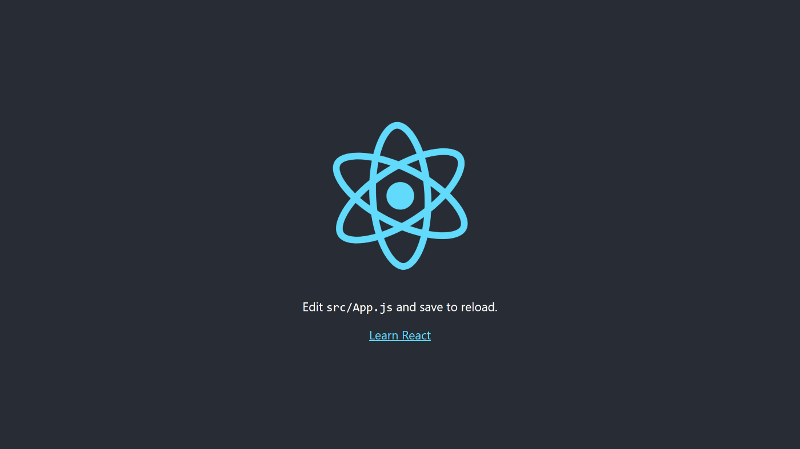
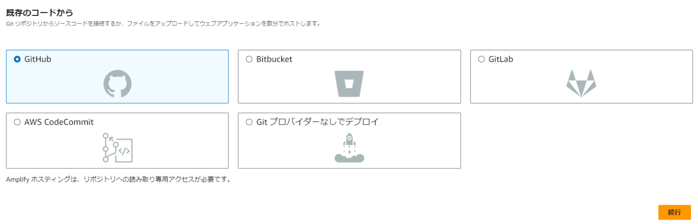
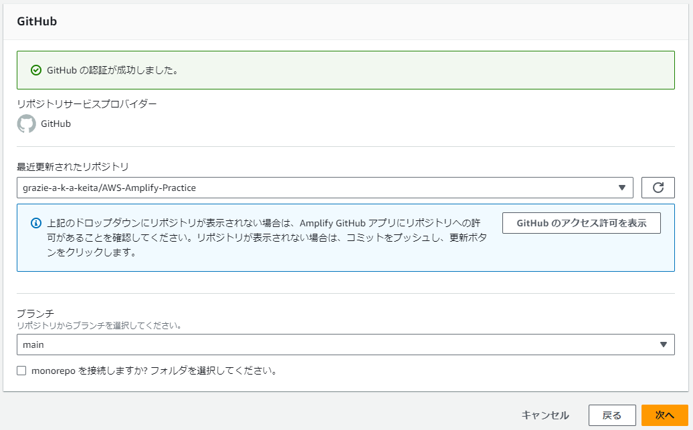
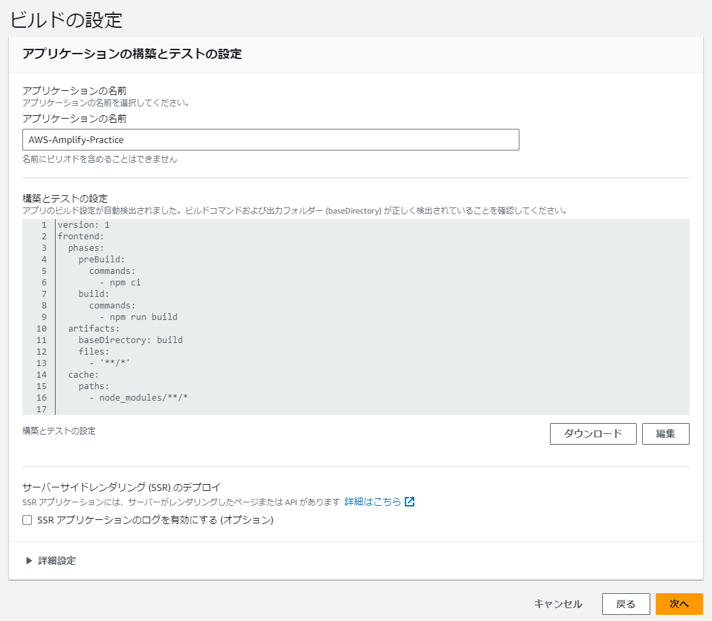
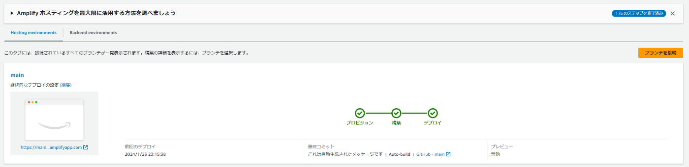
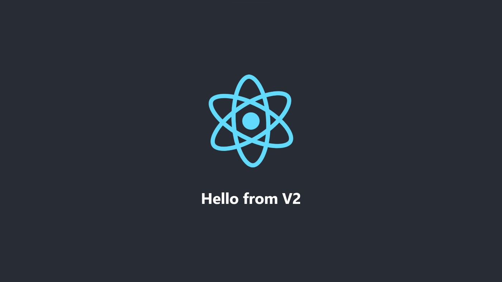

近頃、React等で開発した際、ホスティング方法として「CloudFront+S3」を手動で構成する手法をよく使用していましたが、手動めんどくさいなぁなんて思っていたところに「AWS Amplify」を見つけたので、今回は[フルスタックReactアプリケーションを構築する](https://aws.amazon.com/jp/getting-started/hands-on/build-react-app-amplify-graphql/)で学習した内容を備忘録として残しておきたいと思います。

Reactアプリケーションをデプロイ + コードの変更の自動デプロイまで行いたいと思います。

## AWS Amplifyとは

> Amplifyには、AWSでフルスタックのウェブアプリやモバイルアプリを構築するために必要なものがすべて揃っています。フロントエンドの構築とホスティング、認証やストレージなどの機能の追加、リアルタイムのデータソースへの接続、デプロイと数百万人のユーザーへの拡張が可能です。

つまり、ウェブアプリでアプリ開発した後に、「AWS Amplify」を使えば、ホスティングやその他認証やストレージなどまるっと簡単に構築できるということですね。

## React アプリケーションの作成

まずはReactアプリケーションの作成を行います。

```shell
$ node -v
v18.16.0

$ npx create-react-app amplify-app
$ cd amplify-app
$ npm start
```

Reactアプリケーションが立ち上がります。



次に、GitHubリポジトリにコードをコミットします。

## Amplifyホスティング

次に、AWSアカウントにログインし、「AWS Amplify」のページから「Amplifyホスティング使用を開始する」を選択する。


「GitHub」を選択し、「続行」を選択する。



無事認証できたので、「次へ」を選択します。



ビルドの設定はデフォルトのまま「次へ」を選択しました。



次の確認画面でも「保存してデプロイ」を選択すると、私の環境では約3分ほどでデプロイ完了しました！

画像左下の`https://...amplifyapp.com`にアクセスすると無事にReactアプリケーションが表示されていることを確認できました！



## デプロイしたアプリケーションの更新

最後に`main`ブランチに変更を加えて、それが自動的にデプロイされるか見てみたいと思います。

下記の変更をコミット + プッシュします。

```diff lang="js" title="amplify-app/src/App.js"
- <p>
-   Edit <code>src/App.js</code> and save to reload.
- </p>
- <a
-   className="App-link"
-   href="https://reactjs.org"
-   target="_blank"
-   rel="noopener noreferrer"
- >
-   Learn React
- </a>
+ <h1>Hello from V2</h1>
```

コミットから、わずか3分ほどで再度`https://...amplifyapp.com`にアクセスすると更新されていることが確認できました！



## 所感

初めて「AWS Amplify」を使用していましたが、わざわざローカルでビルドして「S3」にアップロードするという手順を踏まなくても、ホスティングができるのはすごく楽だなと思いました！

また、GitHubと連携できるのもGoodだと感じました！
