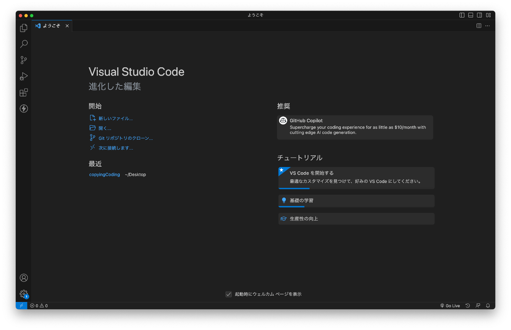
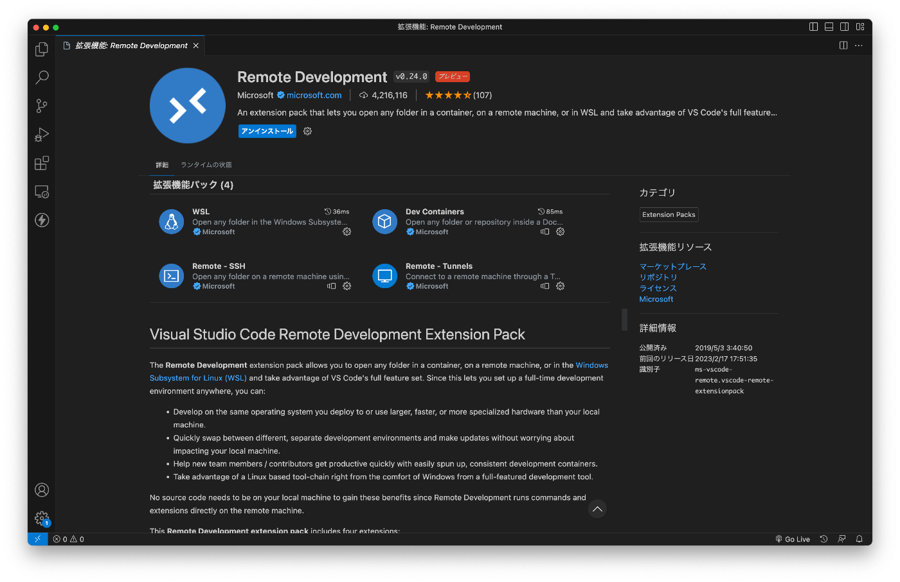
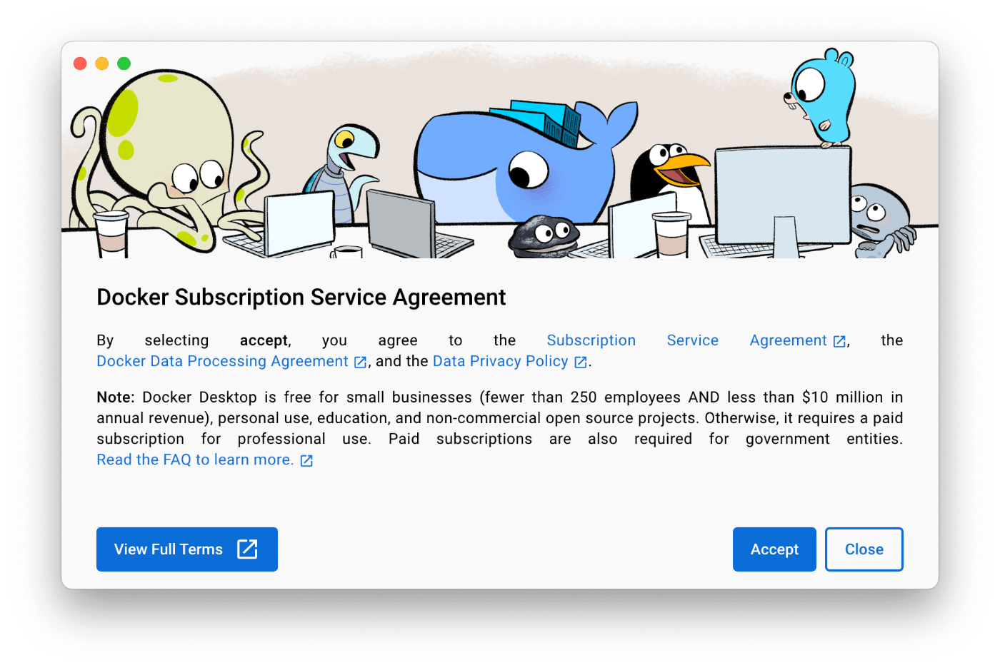
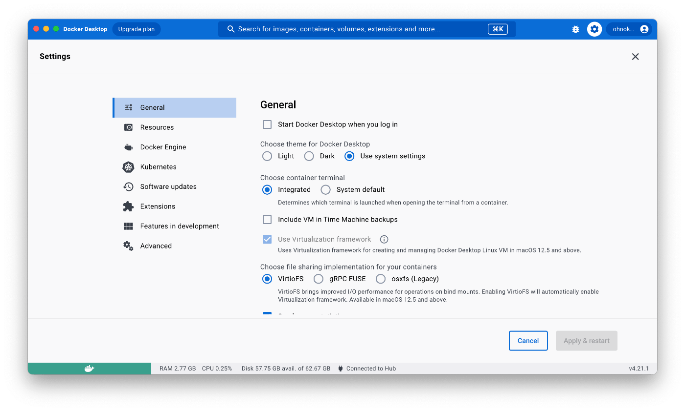
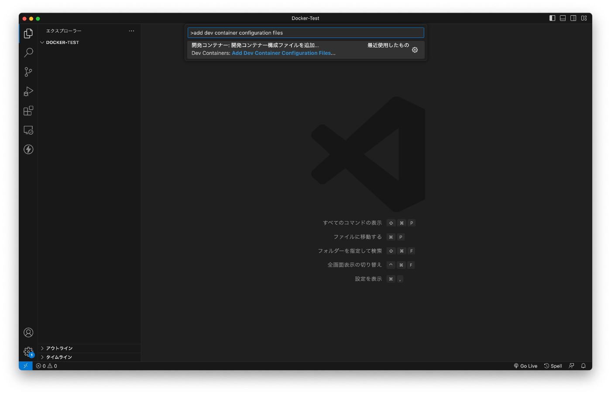
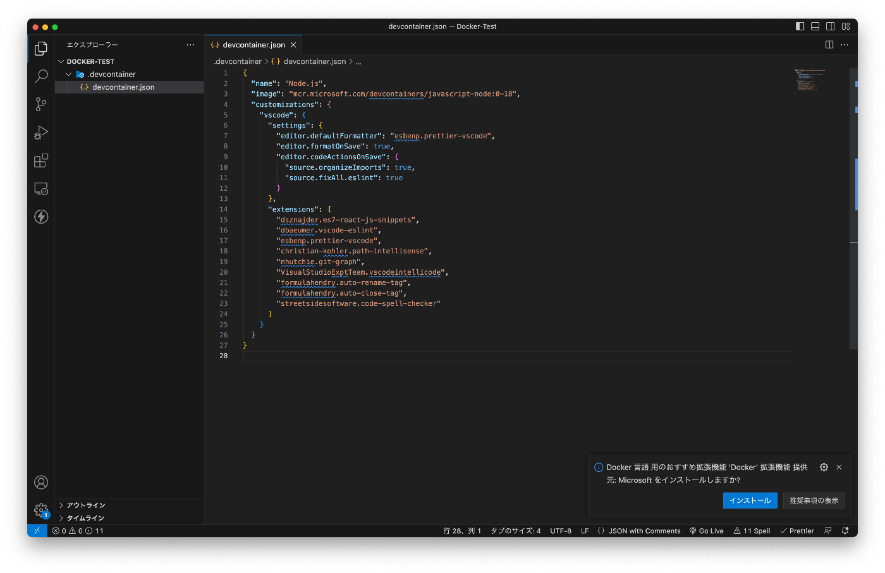
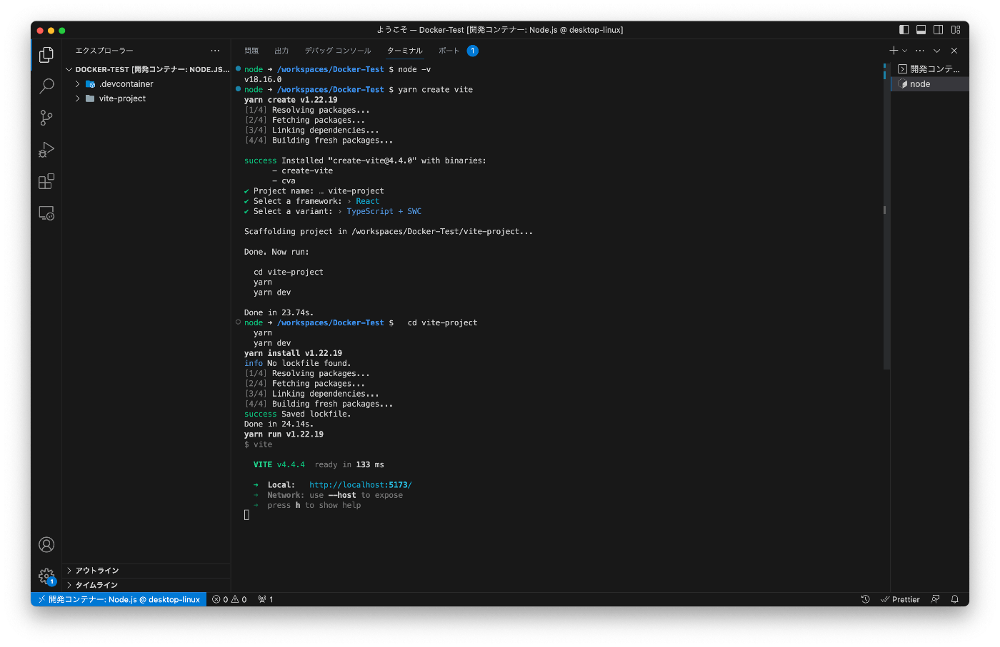
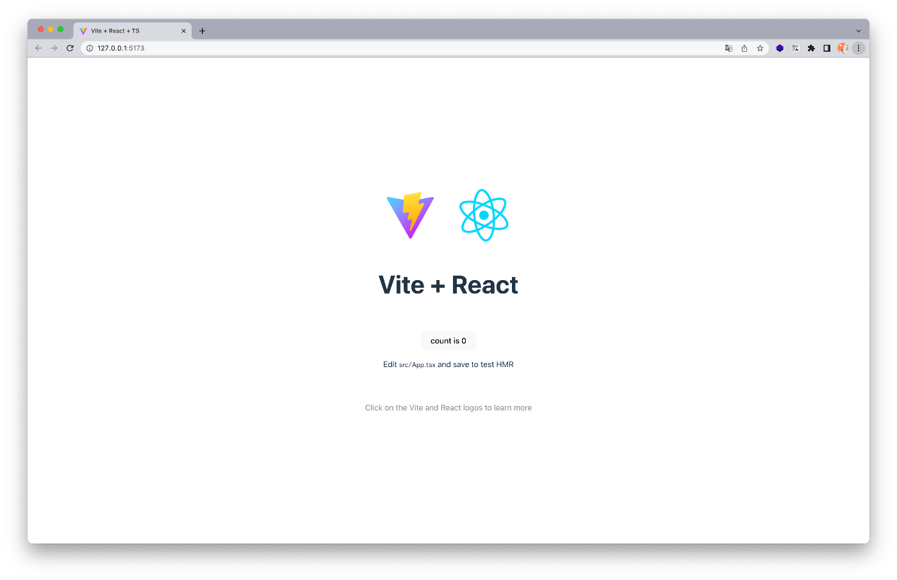

今回はMacBookを購入してDockerの環境を作成したいと思い、Docker環境で開発ができるまでの順序を備忘録として残しておこうと思います。

ちなみに筆者はWindowsユーザーなので、Macについてまだまだ何も知りません。

## VSCodeのインストール

https://code.visualstudio.com/Download

無事インストール成功しました！



とりあえず、よく使う拡張機能や、日本語設定などを済ませました。

Windowsとインストールの勝手が違うのも、Macの難しいポイントです...

## 拡張機能のインストール

拡張機能の中でも、リモート接続を可能にしてくれる拡張機能が必要だそうなので、**Remote Development**というやつをインストールしました。



## Docker Desktopのインストール

https://matsuand.github.io/docs.docker.jp.onthefly/desktop/mac/install/

筆者が使用しているMacBookはM2チップなため「AppleチップのMac」ボタンからdmgファイルをダウンロードしました。

こちらも無事にインストールできて、アプリを起動すると規約画面が表示されました。



筆者はDockerのアカウントは持っていたので、そのままログイン。



無事にDocker Desktopが立ち上がりました！

### Apple silicon のMacについて

> Docker Desktop 4.3.0 からは、Rosetta 2 をインストールするためのハードウェア要件を削除しています。Darwin/AMD64 を利用するにあたって、Rosetta 2 を必要とするコマンドラインツールが少しはあります。 以下の 既知の問題 の節を確認してください。 ただし十分な機能性を確保するためには、Rosetta 2 のインストールをお勧めします。 Rosetta 2 のインストールは、コマンドラインから手動で、以下のようにして行います。
>
> ```bash
> softwareupdate --install-rosetta
> ```
>
> 詳しくは [Docker Desktop for Apple silicon](https://matsuand.github.io/docs.docker.jp.onthefly/desktop/mac/apple-silicon/) を参照してください。

Docker Desktopのサイトの「システム要件」のところにこんな記載があったので、これも「ターミナル」を使って指示通りに実施しました。

```bash
softwareupdate --install-rosetta

I have read and agree to the terms of the software license agreement. A list of Apple SLAs may be found here: https://www.apple.com/legal/sla/
Type A and press return to agree: a
2023-07-16 21:08:51.378 softwareupdate[11257:732832] Package Authoring Error: 042-01896: Package reference com.apple.pkg.RosettaUpdateAuto is missing installKBytes attribute
Install of Rosetta 2 finished successfully
```

途中で同意の旨の確認があったので`a`を入力して`Enter`！

```
Install of Rosetta 2 finished successfully
```

最後に上記のように表示されたので、おそらく成功？

## いざ、Docker環境を使ってみる

今回はReactの環境でも作ってみようかと思います。



`F1`で現れるコマンドパレットに以下を入力して、`.devcontainer`を作成。

「**add dev container configuration files**」

設定で「Node.js」を選択。



ひとまず、`Dockerfile`は削除して、`devcontainer.json`の中身をReact仕様に変更しました。

```json
{
  "name": "Node.js",
  "image": "mcr.microsoft.com/devcontainers/javascript-node:0-18",
  "customizations": {
    "vscode": {
      "settings": {
        "editor.defaultFormatter": "esbenp.prettier-vscode",
        "editor.formatOnSave": true,
        "editor.codeActionsOnSave": {
          "source.organizeImports": true,
          "source.fixAll.eslint": true
        }
      },
      "extensions": [
        "dsznajder.es7-react-js-snippets",
        "dbaeumer.vscode-eslint",
        "esbenp.prettier-vscode",
        "christian-kohler.path-intellisense",
        "mhutchie.git-graph",
        "VisualStudioExptTeam.vscodeintellicode",
        "formulahendry.auto-rename-tag",
        "formulahendry.auto-close-tag",
        "streetsidesoftware.code-spell-checker"
      ]
    }
  }
}
```

またまた、`F1`で現れるコマンドパレットに以下を入力して、コンテナの作成！

「**open folder in container**」

少しコンテナの作成には時間がかかりますが、数分で終了しました。

そして、Node.jsのバージョンを確認してみたところ無事に完了してそうでした！

```bash
node -v
```

あとはここに記載されている通りにReactプロジェクトを作成します。

https://ja.vitejs.dev/guide/

こんな感じで、進めていきました！



すると無事にReactが起動しました！



以上で、MacでのDocker環境作成が完了となります！

これで、よりよい開発ライフが送れそうです！

## まとめ

WindowsでDocker環境を作るよりもMacのほうが遥かに簡単でした。
