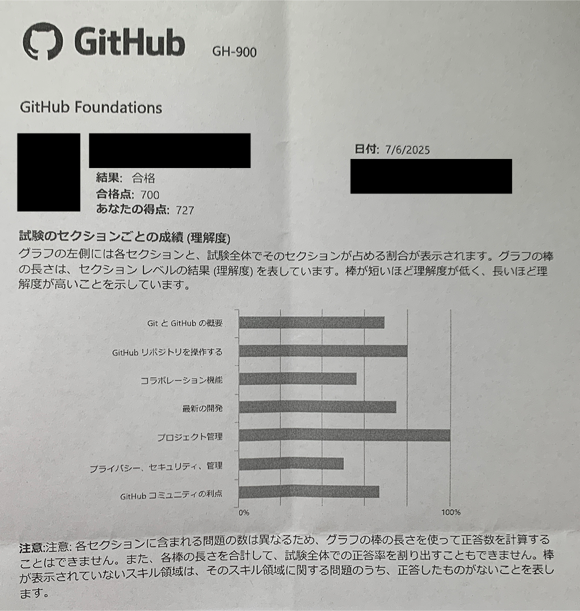

3ヶ月ほど時間差の投稿にはなってしまいますが、先日（2025年7月6日）に**GitHub Foundations**に無事合格できたので、その話です。

## GitHub Foundations

まずは、GitHub Foundationsについて超ざっくり説明。

GitHub Certifications（GitHubの認定資格）の入門的な資格で、GitHubの基本的な使い方や概念を学ぶことができます。

> GitHub Certificationsを取得すると、GitHubのテクノロジとワークフローに関する専門知識を示すことができます。GitHub Certificationを取得すると、特定のGitHub分野におけるスキルを示すことで、雇用市場での競争力を高めることができます。

らしい。

試験の対象は以下となっており、GitHubの基本的な使い方を学べるイメージです。

- コラボレーション
- GitHub製品
- Gitの基礎
- GitHubリポジトリでの作業

一応他にも、以下の資格があるみたい。

- GitHub Actions認定
- GitHub Advanced Security認定
- GitHub管理者認定
- GitHub Copilot認定

### 試験概要

料金は`$99`（私が受験したときは`13,398円（税込）`）で、試験はオフラインで受験しました。

詳細は以下に記載されており、申込みもここから可能です。

https://learn.microsoft.com/en-us/credentials/certifications/github-foundations/?practice-assessment-type=certification

## 受験当時のスペック

- エンジニア歴4年目
- GitHubはプロジェクトではあまり使ったことないけど、個人では毎日ぐらいで使ってる
- そんなに難しいことはしてなくて、リポジトリ管理、コミット、プッシュ、イシュー、Actionsぐらいは使ってる
- 一応、会社のGitHub Enterpriseの管理者権限を持ってメンバー、チーム管理をした経験はある
- バリバリやってたわけではない

GitHubは日常的に使ってるし、基本的な動作はできるけど、試験で出てくるようなより細かい機能や用途の知識はあまりないぐらい。

## 勉強方法

実践した勉強方法。

### 1. 公式のラーニングパス

正直私自身、知ってる箇所も多かったので、あまり深堀りせずにサクサク進めました。

知らない範囲を認識するぐらいのイメージです。

https://learn.microsoft.com/en-us/training/paths/github-foundations/

https://learn.microsoft.com/en-us/training/paths/github-foundations-2/

### 2. Udemy

次に、実践的な問題をこなすためにUdemyの以下のコースを受講しました。

60問の演習が4つあって、解説付きなので、これは割とやり込みました。

大体9割ぐらいの正答率になるまでやりました。

※たまに公式ドキュメントと見比べて「違うやん！」みたいなやつもありましたが、無視しました。

https://www.udemy.com/course/github-foundations/?srsltid=AfmBOoogvWkCgPHfdjHuOvq0fjFUomdad_qrMArhFW_UfTeK0FxE0X9y

### 3. 模擬問題集

あとは、補助的に以下の模擬問題集も活用しました。

有志で作成された問題集みたいです。（ありがとうございます... 🙏）

https://ghcertified.com/ja/

ちなみに、以下に問題の一覧があるので私は、これらを眺めて、わからない箇所、理解が微妙な箇所を公式ドキュメントで確認した程度でした。

https://github.com/FidelusAleksander/ghcertified/tree/master/content/ja/questions/foundations

## 勉強期間

他の勉強も並行しながら進めていたこともあり、トータルで約2ヶ月ぐらい。

1日に平均して1時間ぐらいかけてた感じです。

| 学習方法             | 期間         |
| -------------------- | ------------ |
| 公式のラーニングパス | 1 ヶ月ぐらい |
| Udemy                | 3 週間ぐらい |
| 模擬問題集           | 1 週間ぐらい |

## 結果

試験結果としては、`727点`で合格でした〜🎉

合格点700点なので、結構ギリギリ...

Udemyや模擬問題集よりもやや深掘りされた内容の問題があった印象でした。

ちなみに、結果は試験終了後すぐにPC上で表示される形式でした。

試験終了後には、こんな紙も一緒にもらいました。

## 受験してみて

日常的に使うツールなので、エンジニアである以上は受験してみて損はない資格だと思いました。

他にも、GitHub Actionsや管理者向けの資格等もあるので、気が向いたら受験してみたいと思います。
