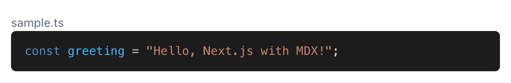
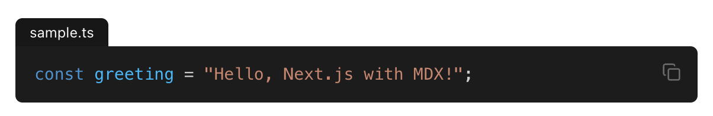

今回は、Next.jsでMDXのコードブロックにシンタックスハイライトを適用します。

## 使用技術

- Next.js`15.5.2`
  - Turbopackは使用していません
- MDX
  - Next.jsでの詳細な使用方法は[こちら](https://nextjs.org/docs/app/guides/mdx)をご覧ください
- Tailwind CSS
- shadcn/ui
- **rehype-pretty-code**
- その他プラグイン

## 実装

まずはNext.js公式の手順通りにMDXを導入します。

```sh
npm install @next/mdx @mdx-js/loader @mdx-js/react @types/mdx
```

MDXをきれいに表示するツールたちとシンタックスハイライトを適用するために、以下のパッケージをインストールします。

| プラグイン                                                                            | 役割                                                    |
| ------------------------------------------------------------------------------------- | ------------------------------------------------------- |
| [rehype-pretty-code](https://rehype-pretty.pages.dev/)                                | シンタックスハイライト                                  |
| [remark-gfm](https://github.com/remarkjs/remark-gfm)                                  | GitHub Flavored Markdown                                |
| [react-children-utilities](https://github.com/fernandopasik/react-children-utilities) | Reactの子要素を操作する                                 |
| [@tailwindcss/typography](https://github.com/tailwindlabs/tailwindcss-typography)     | Tailwind CSSのTypographyプラグインで、MDXのスタイル調整 |

```sh
npm install rehype-pretty-code remark-gfm react-children-utilities
npm install -D @tailwindcss/typography
```

`next.config.ts`を`next.config.mjs`に変更し、以下のように設定します。

```js title="next.config.mjs"
import createMDX from "@next/mdx";
import rehypePrettyCode from "rehype-pretty-code";
import remarkGfm from "remark-gfm";

/** @type {import('next').NextConfig} */
const nextConfig = {
  pageExtensions: ["js", "jsx", "md", "mdx", "ts", "tsx"],
};

/** @type {import('rehype-pretty-code').Options} */
const options = {
  // ここでテーマを指定できる
  theme: "dark-plus",
};

const withMDX = createMDX({
  options: {
    remarkPlugins: [remarkGfm],
    rehypePlugins: [[rehypePrettyCode, options]],
  },
});

export default withMDX(nextConfig);
```

設定できるテーマ一覧

http://shiki.style/themes#themes

プロジェクトルートに`mdx-components.tsx`を作成します。

```ts title="mdx-components.tsx"
import type { MDXComponents } from "mdx/types";

const components: MDXComponents = {};

export function useMDXComponents(): MDXComponents {
  return components;
}
```

Tailwind CSSのTypographyプラグインも忘れず設定します。

```css title="globals.css" {4}
@import "tailwindcss";
@import "tw-animate-css";

@plugin "@tailwindcss/typography";

/* ...省略 */
```

親要素に`prose`クラスを追加するとMDX要素がキレイに表示されます。

```tsx title="layout.tsx" {6}
// ...省略

return (
  <html lang="ja">
    <body className={`${geistSans.variable} ${geistMono.variable} antialiased`}>
      <div className="prose">{children}</div>
    </body>
  </html>
);
```

これで、コードブロックにシンタックスハイライトが適用されるようになります。



あとは、`mdx-components.tsx`でコードブロックのスタイルを調整したり、コピー機能を追加したりしていきます。

まずは、コピーボタンを作ります。

ボタンがクリックされたら、propsで渡されたテキストをクリップボードにコピーし、2秒間チェックマークを表示するようなコンポーネントです。

```tsx title="components/copy-button.tsx"
"use client";

import { Check, Copy } from "lucide-react";
import { useState } from "react";
import { cn } from "@/lib/utils";
// shadcn/uiのButtonコンポーネントを使用しています
import { Button } from "./ui/button";

export default function CopyButton({
  text,
  className,
}: {
  text: string;
  className?: string;
}) {
  const [isOk, setIsOk] = useState(false);

  return (
    <Button
      size="icon"
      variant="ghost"
      className={cn("relative hover:bg-accent/10", className)}
      onClick={() => {
        setIsOk(true);
        setTimeout(() => setIsOk(false), 2000);
        navigator.clipboard.writeText(text);
      }}
    >
      <Check
        className={cn(
          "-translate-x-1/2 -translate-y-1/2 absolute top-1/2 left-1/2",
          "text-muted-foreground transition-opacity duration-300",
          isOk ? "opacity-100" : "opacity-0",
        )}
      />
      <Copy
        className={cn(
          "-translate-x-1/2 -translate-y-1/2 absolute top-1/2 left-1/2",
          "text-muted-foreground transition-opacity duration-300",
          isOk ? "opacity-0" : "opacity-100",
        )}
      />
      <span className="sr-only">コピー</span>
    </Button>
  );
}
```

あとはコードブロックで使用される要素をカスタマイズしていきます。

```tsx title="mdx-components.tsx"
import type { MDXComponents } from "mdx/types";
// onlyTextはReactの子要素からテキストだけを抽出するユーティリティ
import { onlyText } from "react-children-utilities";
import CopyButton from "./components/copy-button";

export const components = {
  figcaption: (props) => (
    <figcaption
      className="w-fit rounded-t-sm bg-primary px-3 py-1 text-primary-foreground text-xs"
      {...props}
    />
  ),
  pre: (props) => {
    return (
      <div className="relative">
        <pre
          className="mt-0 rounded-sm rounded-tl-none"
          {...props}
          tabIndex={-1}
        />
        <CopyButton
          text={onlyText(props.children)}
          className="absolute top-1 right-1"
        />
      </div>
    );
  },
} satisfies MDXComponents;

export function useMDXComponents(): MDXComponents {
  return components;
}
```

完成！🥳



## 参考にさせていただいた動画

https://www.youtube.com/watch?v=I_2wLQ5Ee5c
