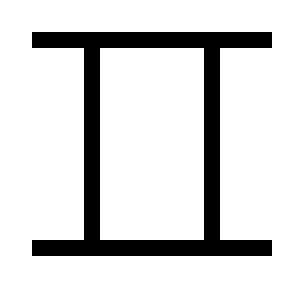

新しいアイデアを生み出す必要があるとき、水平思考の重要性を感じる機会が増えました。

そこで、エドワード・デボノの『水平思考の世界 固定観念がはずれる創造的思考法』を読んでみました。

まずは章ごとに要点をまとめてみます。

## はじめに

### 垂直思考と水平思考

- 垂直思考と水平思考は異質且つ正反対

### 垂直思考

- 新たなアイデアが生まれることを阻害することもある
- 一つ一つプロセスを踏みながら状況を分析する術
- 幼い頃から教えられる思考

### 水平思考

- 習得できる技能
- 一つ一つプロセスを踏まない思考プロセス

---

## 1章 人生には、水平思考でしか解決できない問題がある

確実性の高い、直進的な思考としての垂直思考と、確実性の低い、脇道にそれる思考としての水平思考の違い

### 垂直思考と水平思考

- 商人の娘と小石の話
- 水平思考でしか解決できない問題があり、それまでは解決不能だと思われてた出来事の解決策が突如明らかになることがある。
- ただ、その発想はあまりに当たり前すぎて、思いつくまでになぜそれほど苦労したのかがわからなくなるほど
- 水平思考
  - 物事の新しい見方や、あらゆる種類の新しい発想に関わりをもつ
  - 垂直思考とは全く異なる思考法だが、役に立つもの
- 垂直思考
  - 信頼できる唯一の思考法で理想形だと考えられてきた
  - 1つ1つ順序を踏んで思考を進める思考法

### 視点を変えれば、限界こそが強みになる

- 水平思考によって解決策に到達した後に、垂直思考で合理化するのは害はないが、垂直思考を用いて、何でも簡単に解決できる訳ではない
- 垂直思考と水平思考は相補的である
  - 垂直思考には限界があり、新たなアイデアを生み出すには水平思考が有効である

### 水平思考が目指すのは「大発見の瞬間」

- 垂直思考は高い確実性を志向するが、水平思考は低い確実性を志向する
  - この低い確実性が新しい効果的なアイデアにつながる→この瞬間を水平思考は目指す
- 水平思考はすべてのプロセスがコントロールされているので、方向性は見失わない
- 垂直思考は論理が頭脳を支配するが、水平思考は頭脳が論理を支配する
- 水平思考は、誰でも意識することで、身につけることができる技術
  - 一つの心構えであり、クセである

---

## 2章 誰にでも入手可能な既成の情報を、新しいやり方で見つめなおす

垂直思考だけに頼ったのでは、残念ながらアイデアが生まれない場合について

### 専門知識によって新しいアイデアを思いつくわけではない

- タイトル通り、専門知識があるからと言って、新しいアイデアを思いつくわけではない
- 新たなアイデアがもたらされるプロセスと、そのアイデアの実際の重要性は切り離せる
  - つまり、アイデアの重要性に気づいていなくとも、アイデアを生み出すことは可能だ

### テクノロジー自体が、新しいアイデアを生むわけではない

- テクノロジーがあるから、新たなアイデアが生まれたという例もあるが、テクノロジー自体が新たなアイデアに寄与しているわけではない。
- 有名な発明家は次々にアイデアを生み出す
  - ある種の人々はアイデアを生む能力が高い
  - 知力だけではなく、ある特定の頭の習慣、考え方に関わる
- アイデアに対する唯一の報酬は「達成の喜び」である

---

## 3章 新しいアイデアと既成のアイデアの複雑な関係

- 支配的なアイデアが持つ二極化の効果について
- 垂直思考は、同じ穴をより深く掘ること
- 水平思考は、他の場所で新たな穴を掘ること

### 教育は伝達的ではあるが創造的とはいえない

- 教育の目的は、役に立つと思われる知識を広く提供すること
  - 新たな穴を掘る能力は身につかない
- 間違っている穴でも大きく掘り進めている方が、新たな穴を掘ろうと思案しているより、評価もしやすい
  - 実は、座り込んで思案している人の方が、価値ある穴を掘ることに大きく近づいている可能性もある

### 既成のアイデアによる支配の影響力

- 専門家 = 今掘っている穴を誰よりも理解している
- 人は論理によって穴を大きくすることに喜びを感じ、教育がそうなるように奨励し、専門家を選んできたがゆえに、着実に大きな穴が増えていく
- 骨折り損でもいいから、誰も掘らない場所に穴がもっと多くあるべき
  - そのためには、これまで支配的だった存在の穴への思い入れから自由になることが必要
- 既成の支配的なアイデアは、新しいアイデアを取り込んで、より強固になってしまう

### 支配的アイデアの影響力から逃れるには？

- 支配的なアイデアから逃れるテクニック
  - ① 支配的だと思われるアイデアを慎重に選び出し、明確にし、書き留める
    - 影響を認識し、回避できる
  - ② 支配的なアイデアを認識し、アイデンティティを失って崩壊するまで、歪めていく
    - アイデアを極端に追い詰めたり、一部分を誇張したりする
- アンチパターン
  - 支配的なアイデアを識別し、退ける
    - 肯定的支配と否定的支配を入れ替えているだけ
- そもそも支配的なアイデアから逃れることは難しい
  - 外部からの助けがなければ、逃れることができない場合もある

### 間違えることに喜びを見出す

- アイデアを追求するために、支配的なアイデアから逃れることができないという以外に、怠慢から支配されることもある
  - 自分で考えるより、筋の通ったまとまったアイデアを受け入れる方が楽だから
- アイデアが間違っている = 既成のアイデアから抜け出して新たな視点を獲得している
  - 役にたたなかったとしても、既成のアイデアを打ち破ったという部分に価値がある
- 3章のまとめとして、「**水平思考にとって、支配的なアイデアは便利なものではなく、むしろ障壁になる**」ということが言える

---

## 4章 水平思考の視覚トレーニング

水平思考の視覚的訓練。とある見慣れない図形を見て、他の誰かに説明することを例に、水平思考の考え方を学ぶ章。

ざっくりこんな感じの内容。

たとえば、この図を説明するとしたらみたいな導入で始まる。

図形を分割して、説明するのがやりやすいので、多くの場合、図形を分割して説明することになる。

- 2本の横棒を2本の縦棒が支えている（ざっくりです）など様々...

この図だけでなく、様々な図形を説明するうちに、本書では、T字型に分割することが汎用的に説明しやすいとわかってくる。

ただ、T字型に分割することが説明しやすいからといって、T字型は任意に分割された単位であって、T字型が図形の構成要素であるわけではない。

T字型の有用性が証明されるたびに、T字型に当てはめて考えたくなるが、T字型はあくまで説明のための分割であって、図形の構成要素ではないことを忘れないようにする必要がある。I字型に分割して説明したほうが、説明しやすい図形もあるかもしれない。

つまり、より良い説明のための分割方法を探し続けることが重要であって、T字型に分割することが重要なわけではない。

また、見慣れた図形の組み合わせ方だけではなく、見慣れた図形を疑問視しなければならないときがいずれ来る。T字型を更に分割したら、説明しやすい図形だってあるかもしれない。

**描写説明に用いられる単位は任意に選ばれたものにすぎず、非常に役に立つ単位であっても、それしかないと思い込んでしまうと、より良い描写説明が生み出されることを妨げることになる。**

---

## 5章 水平思考の言語トレーニング

さまざまなものの見方を意識的に探求する

水平思考の原則

1. 支配的なアイデアを認識すること
2. さまざまなものの見方を探し求めること
3. 垂直思考の強い支配から抜け出すこと
4. 偶然の機会を活用すること

さまざまなものの見方を探求することについて書かれた章

### ものの見方を少し変えるだけで、結果が大きく変わる

- 解決しなければならない問題があるとき、ものの見方を少し変えるだけで、結果が大きく変わる
- 常識的な物の見方から、それほど常識的ではない物の見方に変える
  - 習慣になれば、特別難しいことではない
- 問題の1部分から別の部分に注意を向けるのは簡単だが、問題の部分そのものを変えるのははるかに難しい

### 言葉や名前がつくと、見方が固定されてしまう

- 人間の頭は、取り巻く世界の連続的な遷移を、別々の単位に分割している、そして、これらの単位に名前をつける
- 名前がつくと一度、不変になる
  - → 不変の意味を持ったときにレッテルが貼られるように
- 名前がつかないうちは流動的にものを見れるが、名前がつくと、ものの見方が固定されてしまう
- 水平思考のように、組み立て→分解→再構築を繰り返す思考法にとって、最善の見方を見出す機会の損失になる

### 視覚的イメージでものを考える

- 言葉の硬直性を避けるためのテクニック
  - 言葉を使わずに、視覚的イメージでものを考える
  - 難しいが、身につけることが大事
- 視覚的イメージには流動性と柔軟性がある
- 固定化された単位から抜け出すテクニック
  - 更に小さな単位に分割して、再構築し、新しい単位を作る
  - 比較的簡単
- 努力と練習で身につけることができるが、結局のところ役にたたないものも多い

### 水平思考はあらゆる問題に有効である

- 水平思考を用いるべきは、答えを求められる状況で、それが問題になってるのに、垂直思考が有効でないとき
  - 問題が明確な場合は水平思考が必要だと認識するのは簡単
  - 問題が明確でない場合は、水平思考が必要だと認識するのは難しい
- 問題がなければ、進歩もない
  - 決まりきったワンパターンから抜け出せないから

### 改善の余地は必ずある

- 古い枠組みを通して新しいアイデアを生み出すのは時間の無駄
- 新しい方法と古い方法を比較するのは無益であり、新しいアイデアの妨げになる
- あらゆる物事を疑うことは誰でもできるし、すくなくとも一度はそうした方がいい
- 垂直思考は唯一の見方を論理的に進めるから限界が来る
  - 水平思考は異なるアイデアを意識的に次から次へ試すことによって限界を回避する
  - 水平思考によってアプローチが選択されたら、そこからは垂直思考で進めたらいい

### コロンブスの卵

- [Wiki](https://ja.wikipedia.org/wiki/%E3%82%B3%E3%83%AD%E3%83%B3%E3%83%96%E3%82%B9%E3%81%AE%E5%8D%B5)にもある有名な話
- 問題に取り組む際、解答が存在する範囲を予め想定することが一般的で、その中で垂直思考を使いがち
  - その範囲は仮定であって、実際の解答はその範囲の外にあることが多い
- 水平思考ができない人は、実際には存在もしていない厳格なルールと仮定に縛られている
- 人間の脳にとって自然なのは、最も確実なものの見方によって強い印象を刻まれ、そこから思考を進めること
  - この自然に打ち勝つためには、意識的、人為的に様々なものの見方を試す必要がある
  - その方法の一つとして、物事の見方の数をあらかじめ決めておくという方法がある

### 関係を意識的にひっくり返してみる

- 水平思考でアイデアを生み出す他の方法として、関係を意識的にひっくり返してみるという方法がある
  - 例えば、壁は屋根を支えているのではなく、屋根からぶら下がっていると考えるなど
- 硬直化した物の考え方を打破する他のテクニックとして、その状況をより扱いやすい状況へと移し替える方法もある
  - 元の見方にかかっていた制約が引き継がれない
  - 類似状況は通常、具体的なイメージを伴うので、より簡単に新たなイメージを喚起できる
- 更に最後の方法として、一つの問題のある部分に置かれた力点を別の部分へ意識的に移すこともある
  - 問題が最大限明確に定義されているかは重要じゃない
  - 問題の各部分に順番に注意を注いで、力点を移していくことが重要

---

## 6章 新しいアイデアを生む最大の障壁

新しいアイデアの出現を阻む、垂直思考の傲慢さについて

垂直思考は、新しいアイデアを生み出すのに役立たないばかりか、それを積極的に妨げるものであると気づくことが水平思考の第三の原則であると本書は指摘している。

垂直思考はすべての段階で常に正しくなければならないという考え方があるが、水平思考ではそうではなく、最終的な結論だけ正しければいい

### アドレナリンの発見は、一つの間違った考えがきっかけ

- アドレナリンの発見の例のように、論理の道筋の一つ一つの段階では正しくないかもしれないが、最終的な結論は正しいということもある
- 水平思考によって出された結論が正しいことを正確かつ厳密に証明することは、垂直思考によって出された結論が正しいことを証明するのと同じくらい簡単

### 垂直思考の弱点

- すべての段階が常に正しくなければならないと考える垂直思考では、あらゆる段階で、唯一正しいもの以外をすべて排除する必要がある
  - 他のもっと良い近道を探す必要がなくなってしまう
- 垂直思考で論理的に思考を進める際、その時最良と思われる方向を選ぶことになるが、間違った方向に進んでしまうことがあり、精力的に進んでしまうと
  - 効果的な解決策を得るために正反対の方向に進むことが求められる場合もある
- 水平思考には固定した方向というものがないので、問題を解決するためならいったん問題から遠ざかることも簡単

### 垂直思考をする人は、物事を永遠に分類し続ける

- 垂直思考をする人を全部を型にはめようとする傾向がある
  - アイデアを記号で捉えようと試みるなど
  - 記号化してしまった硬直性は、アイデアを発展させるのに必要なアイデアの自由な収縮や拡大を必ずや妨げることになる
- 垂直思考をする人は何を根拠に物事を分類できるかということに関心を抱く
- 水平思考をする人は何を根拠に物事を統合できるかということに関心を抱く

### 新しいアイデアは、論理的に矛盾しているようにみえることがある

- アイデアというものも初期の段階では、論理的に受け入れがたいような矛盾した形で存在することもある
  - だからといってそのアイデアが有益な新しいアイデアに発展する可能性がないということではない
- 新しいアイデアは論理的に説明できないものかもしれないが、それにはっきりした形を与えて、認識できるようにしたいというのが人間の性質である

### 新しいアイデアは、ひとりでに熟成していく

- アイデアが生まれた時、性急に熱心に論理で考えすぎると、アイデアを凍結させてしまったり、古い型にはめてしまったりすることになる
- 常に正しくあるべきだと考えてアイデアを思いつかないより、間違いが合ってもアイデアが次々に湧いてくるほうがマシ
- アイデアというものはただ成長するのを見守るだけで良い

### 発明家たちは、外野の論理的な判断に負けなかった

- アイデアを実用化する場合に、経済上の安全弁の役割を果たすものが論理的判断である
  - だが、論理的判断が扱えるのは既知の事実のみ
  - また、論理的判断が間違っていることもある
- 論理的判断が必ずしも正しいものではないとわかってさえいれば、使い方を加減することもできる
  - わざと間違ったことを試みることも、時には役立つときがある
- 論理的にありえないと思われるアイデアを早々に却下するのではなく、とりあえずいろいろな方向に発展させてみる
  - 見かけよりも難しいことだが、既成のものの見方に疑問を抱くことができ、より良い物の見方が見つかることもある
- 水平思考をするときは、ただ気づくだけで、それに意味を与えたりする必要がない
  - この意識があれば、偶然が働いて新しいアイデアが生まれやすくなる

---

## 7章 偶然を味方につけた発明家たち

偶然を利用する。偶然というものの価値を認識し、それに干渉せず、偶然がもたらすプロセスを助長して成果を得る

水平思考の第四の原則は、偶然を活用して新しいアイデアを生み出すこと

偶然の出来事を計画的に引き起こすというのは不可能だが、偶然のプロセスを利用することは可能である

### 偉大なる偶然

- まずは偶然の出来事によって始まった、進歩に対する価値ある貢献を認識することが大切
  - 誰でも経験しているであろうこと
- 偶然の出来事が、一つ起これば新しいアイデアが生まれるということではない
  - 一連の状況がその背景になければならないこともある
- 探し求めることがなかったであろう何かに目を向けるきっかけを与えてくれるという点で、偶然というものは有益

### 「遊び」の重要性

- 偶然が考えてもみなかったであろうことに目を向けるきっかけを与える働きを持っているとすれば、その理想的な方法は「遊び」である
  - 遊びは偶然の働きを引き出そうとする実験であるとも言える
  - 計画的に真面目に遊ぶのは、遊び本来の目的ではない
- 垂直思考をする人は遊ぶことを恥だと考えるが、遊ぶことができないことこそ恥じるべき
- こどもが遊ばなくなるのは、世界の何もかもが論理的に説明されてしまう見慣れた場所へと変わっていくから

### 気になるものは何でも試してみる

- 遊びを通じて、頭で管理せず、ただ好奇心を失わずに追い求めればアイデアは次々に湧いてくる
  - アイデアが役に立たなくても、後になって役立ったり、役に立つバックグラウンドになったりする
- アイデアの偶然の相互作用を促すもう一つの方法は、ブレーンストーミングである
  - どんなにバカげた考えでも、見当違いでも、他人の考えを批判するのを差し控える
  - そうすることで互いに刺激しあい、参加者の誰もが考えてもみなかったような新しいアイデアが生み出される可能性がある

### 科学者が好きな言葉、セレンディピティ

- 思いもつかないような現象に溢れた場所をうろつき、大量の刺激に身をさらすことも、新たなアイデアを思いつく有効なテクニックである
  - 雑貨屋、展覧会、図書館
  - ガラクタを集める気持ちで、注意を引くものなら何であれ拾っておけば良い
  - 分析したりする必要はない
- 偶然の相互作用を促すもう一つの方法は、折々に頭に浮かんだ別々の系統の考えを意識的により合わせること
  - 一つの分野ですでに標準的になったものの見方が、別の分野では独創的なものの見方になる
- 何かを探しているときに、それとは全く別の非常に価値あるものを偶然見つけることを「セレンディピティ」という
- 偶然のプロセスが効果的に作用するためには、硬直化した古い体制から情報を解き放ち、他の情報と自由に相互作用し合えるようにしておく必要がある

### 脳は、行き当たりばったりが理想的

- 関連のある情報だけを探すことは、その情報の有用性を決定してしまおうとするようなもの
  - 古い情報と関連のある情報のみを検討することによって新しいアイデアを生み出そうとしても、無駄である
  - 関連する情報 = 先入観
- 脳が行き当たりばったりに、あらゆる情報源から情報を受け取れるようにしておくというのが理想的
  - ただ、情報量が多すぎて到底不可能
  - 結局は、専門家を推し進めて関心のある分野をどんどん狭めて行くことになってしまうのがジレンマである

### 重要なのは、いつでも偶然を活かせる状態にあること

- アイデアが基本に近づけば近づくほど、他の分野との相互関係が明らかになり、関連分野はどんどん広くなる
- 偶然に恵まれるには、運が良いのではなく、偶然を掴み取るのがうまい
- 様々な方法でものを見る練習を重ねていれば、ほんの僅かな情報からその背景を理解する能力が伸びてくる
  - 水平思考がうまくなるにつれて、偶然そのものが変わるのではなく、それを掴み取るのがうまくなってくる

### 必ず何らかのアイデアが生まれると確信する

- 新しい見方を促す、有益なテクニック
  - 身近なものをなにか一つ選び出し、それが検討中の問題とどのように関連し得るかを見る
- 関連するすべてのものを網羅することは不可能であるからこそ、影響を与えてくれるものとの偶然の出会いがますます必要になる
- 一つの問題に集中すれば、その凝り固まった考え方から抜け出すのが困難になる
  - 外部からの影響も取り入れて、硬直化した物の見方を変える
- 何かが偶然起きることを待って、必ず何らかのアイデアは生まれることを確信することが必要である
  - 慣れればすぐにアイデアは浮かぶようになる

---

## 8章 水平思考の活用例

水平思考の側面の一つである実用的使用例

水平思考では、実用性が重要であり、その思考過程を理解するのであれば実践が最良の方法である。

いくつかのアイデアが生み出された経緯を簡単に説明してくれる章。

### 「〜が不可欠」という考え方から抜け出す

- 血圧の変化のパターンを見る装置の例
  - 記録と正確さが必要という支配的アイデアを捨てた
  - 水平思考を用いてコストも機器の大きさもかなり小さくすることができた
  - 最初から不適当だと思われた方法を潔く捨てて、従来の先入観から抜け出すことができたこと、幸いにも過去のアイデアを思い出したこと、そして何よりも、この装置をなんの関係もなかったものから刺激効果を受けたことが組み合わさって、新しいアイデアが生まれた例

### それまでに得た成果のすべてを捨て去る

- 肺機能を検査する装置の開発とLゲームを考案した例
  - 見出しどおり、新たなアイデアを考案するときに、発展させるためにそれまでに得た成果のすべてを捨て去る話
  - はっきりとした目的がなくアイデアを巡らせることができたので自由にアイデアを発展できる
    - その時点で見返りが無いように見えるので難しい

### 何かを意識的に取り上げて持つ

- これまでの例の多くは、偶然生じた刺激によって役に立つアイデアが生まれたというケースだが、身近にある何かを意識的に取り上げ、問題との関連性が見えてくるまで粘る方法もある。
  - その「なにか」は無作為に選ばれる必要がある

### 一つのものをただ眺めて、アイデアを発展させてみる

- 心臓の検査をする椅子の話
  - 検討を重ねた椅子よりも事務用の椅子のほうが検査には適していた
  - 意識的な努力を大いに重ねても、たまたま思いついた単純なアイデアには及ばなかったケース
- 一つのものをただ眺めて、そこからアイデアを発展させてみる
  - この場合、そのものと特定の問題との間に関連性を見出す必要はない

### 身の回りのものからヒントを得る

- 身の回りにあるごく普通のものでも、特殊な要求という観点からみてみると、驚くほど役に立つことがしばしばある
  - 特殊な使い方をすると、問題の解決につながることもしばしばあるということ
- 論理を積み重ねることによっても解決できるであろうことも多いが、水平思考と同じようなやり方で解決できたかというとそうではない
  - 垂直思考的な決まりきったやり方に固執しなかったからこそ、水平思考のアイデアが生まれる
  - 結果に達した後で、理論的な説明を付け加えることは常に可能

---

## 9章 垂直思考をする人は、他人に利用されやすい

水平思考を用いないことがもたらす不利益

水平思考は科学的な発明だけでなく、日常でも役に立つものである

### 詐欺師がいなくならない理由

- 水平思考を利用しないのは、新しいアイデアを生み出すことを利用しそこねるだけでなく、他人に操られやすい
- 垂直思考をする人が頭の中で考えることは予測がつく
  - 常に予測可能な、確実性の高い未知に沿って思考を進める
  - マジシャンなど

### 動機を操作する

- 経験は容易に変えられないが、動機を操作することによって確実性を効率的に変えることができる
  - 水平思考
    - ジャーナリスト、広告業に携わる人
      - 物事を様々な見方で見る能力を身に着けている
  - 垂直思考
    - 法律家、医者
      - 固定的で明確なオーソドックスな見方を身に着けている。そうでなければ、経験や専門技術の訓練が発揮されない

### ユーモアと水平思考

- 水平思考が目指すのは、より単純な新しい秩序であって無秩序ではない
- 水平思考は新しい見方が古い見方を完全に置き換えるが、ユーモアは常識的な見方と意外な見方の間をずっと揺れ動く
- ユーモアはある種の水平思考に特有なものである

---

## 10章 水平思考の可能性は無限

- 水平思考の開発と新しいアイデアの扱い方
- 誰しも新しいアイデア自体には興味がないが、役に立つアイデアには興味がある
- アイデア自体の良し悪しよりもそのアイデアを判断する人の能力に負うところが大きい

### 水平思考は、研究開発から経費削減まで役に立つ

- 新しいアイデアを歓迎しないのは、よくわからないようなものに対して危険を冒したくないから
- 水平思考は新しい物の見方が役に立つ分野ならどんな分野でも活用できる
- 新たな素晴らしいアイデアがもたらし得る効果は無限であり、数億円もの節約になる場合もある
- 水平思考に目を開くことは、経営全般に役に立つに違いない

### アイデアを生み出す基本的要素はすでに身近に存在している

- 一つの新しいアイデアが引き金となって、同一人物や別の人物の頭の中に第2の新しいアイデアが生まれ、一種の連鎖反応が起こる
- 水平思考は思考の習慣であり、特殊な訓練によって身につけられるし、意図的な方法でできるはず
- 特定の物の見方から抜け出して新しいものの見方を見つけることは、簡単なことではないが、新しいアイデアを生み出すための基本的要素はすでに身近に存在していることが多いので、必要とされてるのはそれを組み立てる特別な方法だけである

### 部外者の視点

- 水平思考をする人が目指すのは、問題の特徴を読み取る正しい方法を見つけること
- 部外者の見解が役に立つことがある
  - 異なる分野での特殊な経験が役に立つだけでなく、一番近くで問題に取り組んできた人々が発展させたものの見方にはまり込むことがないから
- あらゆる決定には、ある程度の不確実性が伴う
  - 確信を持って決断を下せるのは、想像力の欠如である
  - 数多くの他の選択肢を検討したうえで、そのすべてを却下できる能力があってこそ、下した決断に自信を持てる
  - 良い決断に疑問を投げるのではなく、自由な発想の塊があれば、より確実な決断ができる

### あなたはアイデアマンか、実行者か

- アイデアマン
  - アイデアを生み出すことに特化している人
  - アイデアを生むことに興味があるが、実行に移すことにはあまり興味がない人
  - 怠惰で無能なので、楽なやり方を探す
- 実行者
  - とりあえずアイデアさえあれば、すぐに仕事に取り掛かることができる人
- 伝統的な組織で出世するには新しいアイデアはむしろ邪魔になる。一つのことに専念する力こそが評価される

### 水平思考をする人が役立つ状況と環境

- 理想的なチーム
  - アイデアマンと実行者の両方がいて初めて成り立つ
  - 両者の協力も必要
- 過去は道楽で科学に手を出すことができたので、インスピレーション溢れるアイデアが生まれ、それを実行するための資金もあった
  - 現在はプロジェクトや交付金制度がいろいろな点で研究をコントロールしている
  - 危険なことは、進行に沿って発展するアイデア次第で変わっていくかもしれないあやふやなプロジェクトよりも結果が前もって予測できるプロジェクトのほうが現実的だということ
- 水平思考に秀でた人を探す方法と効果的に使う方法
  - 知能テストでは確実性の高い答えが求められるため、水平思考に秀でた人を見つけるのは難しい
  - 問題が起きたときにどのように対処するかを観察し、取り組み方の柔軟性や落とし穴を避ける能力に注目するのが良い

---

## まとめ

書籍の中で基本的なテーマとされていたことは以下

1. 新しいアイデアを生む手法としての垂直思考の限界
2. 新しいアイデアを生むための水平思考のプロセスの利用
3. シンプルで理にかなった、効果的な新しいアイデアを生み出すという、水平思考の目的

人間にとって垂直思考は自然な考え方なので、水平思考の技術は人為的な感じがするものである

水平思考が習慣になるまではその人為的に見えるであろう思考回路を意識的に使うべき

水平思考の魅力はシンプルな良いアイデアを求める探求であり、誰にでもできる点。なぜなら、水平思考のプロセスは単純に知能だけに頼るものではないから。
