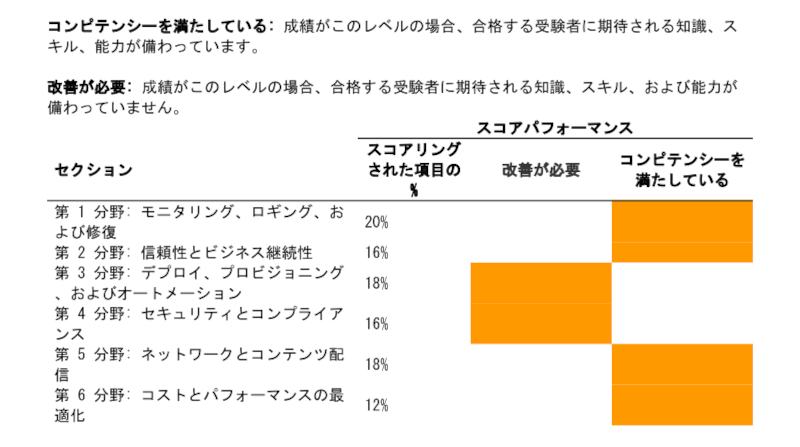

先日、**AWS SOA**（SOA-C02）に無事合格できたのでそのお話をできれば思います！

筆者が試験を受けたのは、2023/4/16で「試験ラボ（実際にAWSのコンソールを触ったりなど、実技試験のようなもの）」が廃止されている期間だったので、試験ラボなしの試験の感想なんかも記事にまとめようと思います。

> 注:2023年3月28日以降、追って通知するまでAWS Certified SysOps Administrator - Associate試験で試験ラボの出題がなくなります。今回の試験ラボの休止は一時的な措置であり、当社ではその間に試験ラボを評価し、受験者に最適なエクスペリエンスを提供するための改善を行います。この変更により、試験は65問の択一選択問題と複数選択問題で構成され、試験時間は130分となります。試験ページにある試験の準備リソースはすべて、この試験形式の変更後も引き続き有効です。

詳しい試験の概要はこちら

https://aws.amazon.com/jp/certification/certified-sysops-admin-associate

## 筆者のスペック

- エンジニア2年目
- AWSの業務経験なし
- ハンズオンをやったり、少し個人で触ったりする程度
- CLF/SAAを取得済み

## 勉強期間

SAA取得後から約2ヶ月ほど

最初の1ヶ月はのんびりやって、残り1ヶ月で追い込んだ感じです！

## 使用教材

### 書籍

まずは1週読み、付属の問題を3週ほどやりました。

一応、全問題解説を見ないで説明できるようにするように心がけていました。

https://www.amazon.co.jp/AWS%E8%AA%8D%E5%AE%9A%E8%B3%87%E6%A0%BC%E8%A9%A6%E9%A8%93%E3%83%86%E3%82%AD%E3%82%B9%E3%83%88-AWS%E8%AA%8D%E5%AE%9ASysOps%E3%82%A2%E3%83%89%E3%83%9F%E3%83%8B%E3%82%B9%E3%83%88%E3%83%AC%E3%83%BC%E3%82%BF%E3%83%BC-%E3%82%A2%E3%82%BD%E3%82%B7%E3%82%A8%E3%82%A4%E3%83%88-NRI%E3%83%8D%E3%83%83%E3%83%88%E3%82%B3%E3%83%A0%E6%A0%AA%E5%BC%8F%E4%BC%9A%E7%A4%BE-ebook/dp/B09ZTJWG83/ref=sr_1_1?__mk_ja_JP=%E3%82%AB%E3%82%BF%E3%82%AB%E3%83%8A&crid=D59S1JN1GS7V&keywords=aws+soa&qid=1682857466&sprefix=aws+soa%2Caps%2C193&sr=8-1

### ハンズオン

機械学習とコンテナ・Codeシリーズ以外のものはすべて取り組みました。

結果、試験ラボ対策とはなりませんでしたが、AWSに対する理解度の深まり方は段違いだったように思います！

https://aws.amazon.com/jp/events/aws-event-resource/hands-on/

### ブラックベルト

https://aws.amazon.com/jp/events/aws-event-resource/archive/?cards.sort-by=item.additionalFields.SortDate&cards.sort-order=desc&awsf.tech-category=*all

正直、書面だけをつらつら読んで勉強するのは苦手なので、サービスの理解が甘いなというところや、模擬試験などをして苦手だなと感じるところだけ読むようにしていました。

### AWS Skill Builder / サンプル問題

サンプル問題に関しては上記の勉強をしっかりやった後に問いたので、難易度が低いこともあってか、楽々回答することができました。

https://d1.awsstatic.com/ja_JP/training-and-certification/docs-sysops-associate/AWS-Certified-SysOps-Administrator-Associate_Sample-Questions.pdf

逆に、AWS Skill Builderで提供されている問題は難しすぎて不安になりました。

多分、こちらはあまり点数が取れなくても、気にしなくていいと思います。

## 所感

試験ラボに関しては、今回なかったですがいつかどこかのタイミングで受けることになると思っているので、今回練習と自身の実力を図ることを兼ねて受けておきたかった...

肝心の試験問題に関しては、結構難しかった印象です。

そこまで多くなかったですが、今回勉強していなかった分野まで出てきて少しびっくりしました。（コンテナ周りやDynamoDB関連の問題などなど）

SOA受ける前に軽くだけでもSAAの範囲も復習しておけばよかったなぁと会場で後悔しました。

私が試験を受けたときは下記のサービスに関連する問題が多く出題されたような気がします。

- Cloud Watch
- Route53
- Cloud Formation
- S3
- Lambda
- Direct Connect
- AWS System Manager

ある程度、予想してたところはある程度溶けた気がしますが、予想から外れた分野の問題でかなり焦りました。

SOA は難しいという記事をよく見ていて、少しビビっていましたが、毎日コツコツと勉強していれば、合格へのハードルはそこまで高くない試験かと個人的には感じました！（試験ラボがなかったのは大きかったかも？）

## 試験結果

スコアは**755点**でした。

思ったより低かったです。

想定外の問題で落としたんでしょうね。きっと。

スコアパフォーマンスについては、

- デプロイ、プロビジョニング、およびオートメーション
- セキュリティとコンプライアンス

がダメでしたね、、

Cloud Formation、暗号化、認証関連あたりの問題がダメだったのかなぁって思ってます...

ちなみに、試験結果はその場で表示されず、試験当日の18:00~19:00あたりにAWS認定のページに反映されていました！

## まとめ

次は、AWS認定 / DVAを勉強して、アソシエイト3冠を目指そうと思います！
